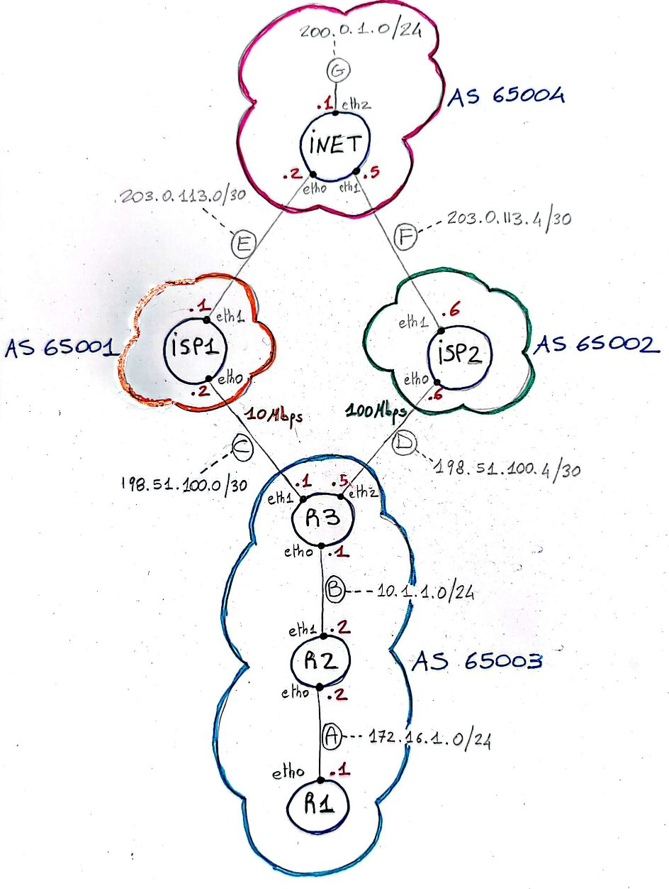

# LAB-K5. BGP Multi-Homed Network

## 5.1 Basic topology

Start a new lab in a new folder implementing the following topology:

A skeleton folder is already provided as zipped file LABK5.zip, containing the basic topology setup, to let you focus on BGP configuration.

## 5.1 Objective

Your main objective is to setup routing protocol(s) so that: 

1. Customer network with AS 65003 can send/receive traffic from the Internet (represented for simplicity by AS 65004) using ISP2 as primary connection, and ISP1 as secondary (backup) connection.
2. Specifically, the LAB is completed successfully if router R1 can ping 200.0.1.1, with both requests and replies flowing through ISP2 (to be verified with traceroute).

## 5.2 Hints
Use local-preference to influence outbound traffic (exiting AS6003). Use AS-PATH prepending (check Internet/AI for its meaning) to influence in-bound traffic (directed to AS 65003)   

## 5.3 Experiment with link failures 
After you setup the routing protocol(s), try to shut down the primary link to ISP2 and see if the secondary link restores connectivity:

1. First, try that by shutting down the neighbor ISP2 inside the BGP configuration terminal on R3 (see slides). How long does it take to restore connectivity?
2. Then shut down one of the ethernet interfaces of the primary link using "ip link set eth<n> down". How long does it take to restore connectivity in this case? why?

## 5.4 (Optional) Use BGP only  
Complete the assignment using BGP only (i.e., use iBGP as IGP protocol inside AS6004) 

