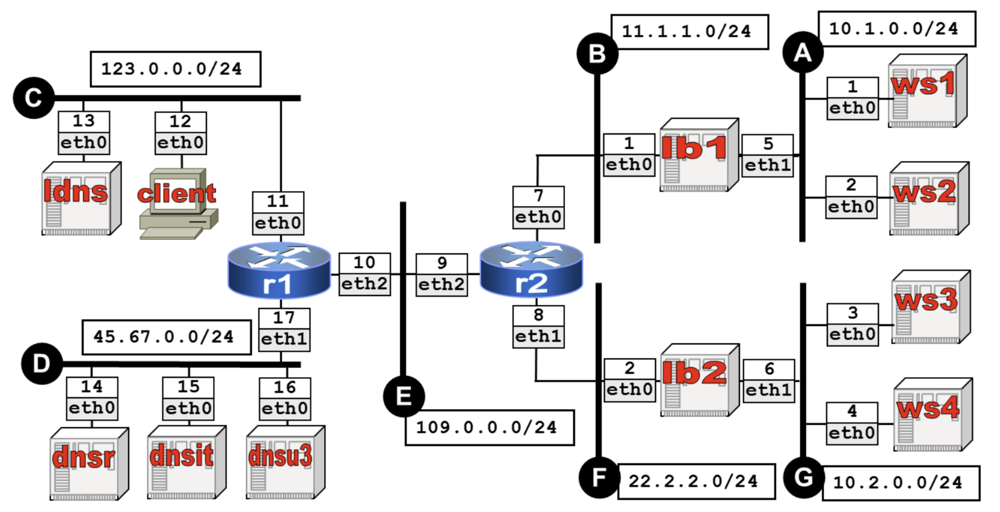

# LAB-K7. Two levels load balancing for a web service

## 5.1 Lab setup

We will consider the network scenario illustrated in the following Figure:

Download and unzip the folder containing the lab setup: kathara-lab_two-levels-load-balancing.zip and familiarize youself
with the main configuration files.

## 5.1 Basic questions

Answer the following questions:  

1. Which file contains the basic configuration allowing the first level of load balancing (by DNS). Why does it work?
2. Which file contains the basic configuration allowing the second level of load balancing (layer-4 load balancing). How does it work?

## 5.2 Test load balancing
Type "links www.uniroma3.it" on the client to experiment load balancing. Try reloading the page sebveral times 
with CTRL-R. What happens? Why? Try closing and launching links several times.   

## 5.3 Sniff DNS traffic 
Use "rndc flush" the clean the cache on ldns.
Connect a wireshark device to collision domain D.
Open any browser on the host machine on localhost:3000, sniff eth1, launch links on the client and identify on the packet trace 
the recursive operation of DNS. 

## 5.4 (Optional) Experiments with machine failures:
1. Failure of ws3: shut down the corresponding container. Try fetching "www.uniroma3.it" from the client. What do you expect to happen? Why?
2. Failure of load balancer lb1: shut down the corresponding container. Try fetching "www.uniroma3.it" from the client. What do you expect to happen? Why?     

